# GH-Connector

Connector for Google Home Devices with SmartThings
<br/><br/><br/><br/>

# Features
### Google Home TTS
### Music Player with File URL or MP3 File of NAS
### Web UI
<br/><br/><br/><br/>

## Sample
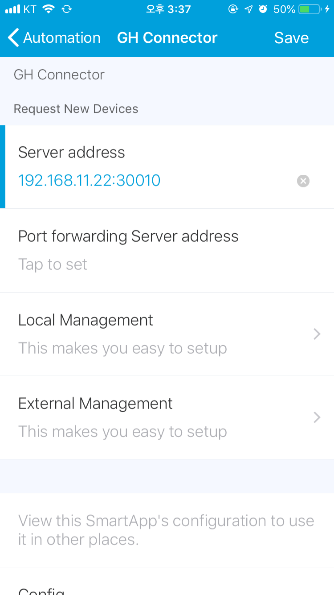
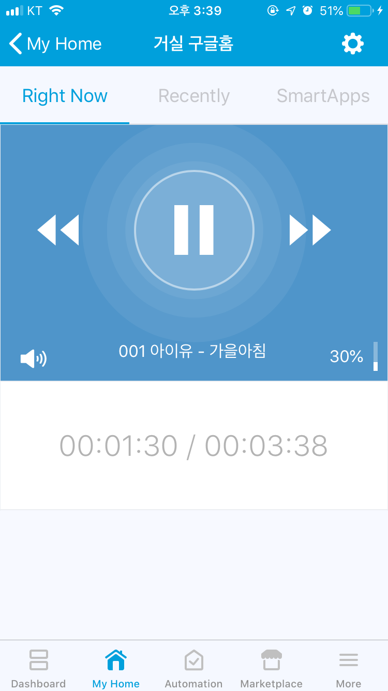
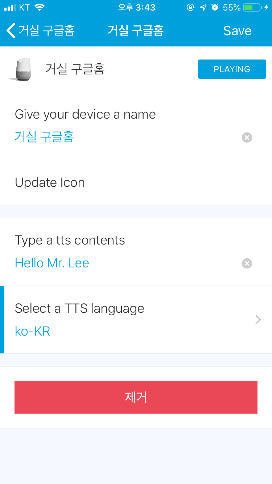
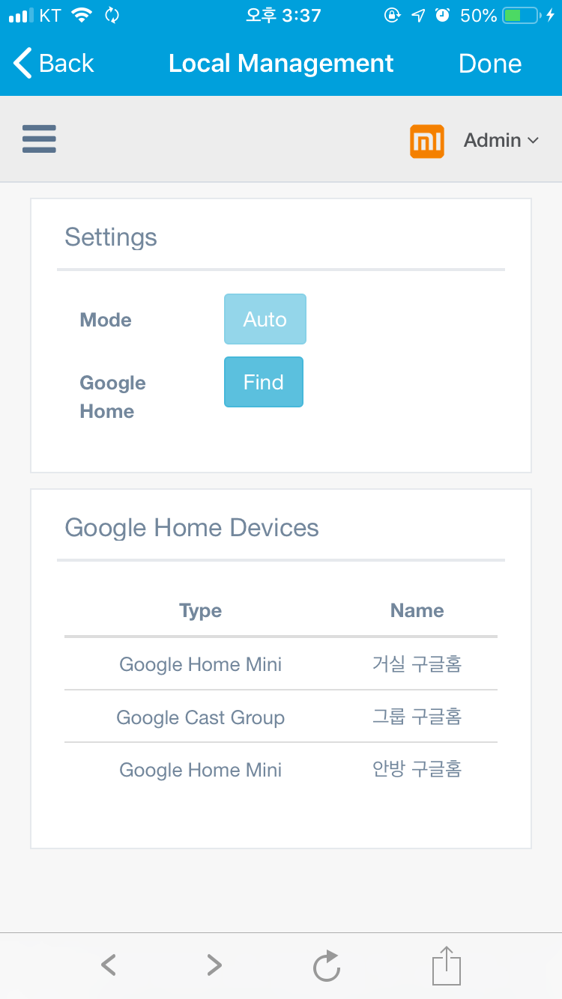
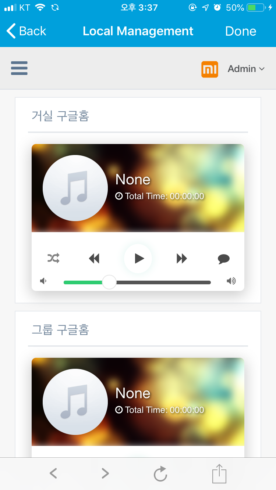
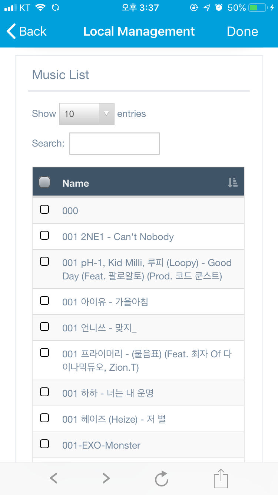
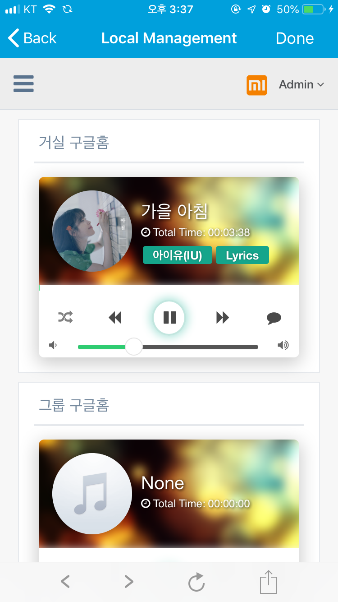
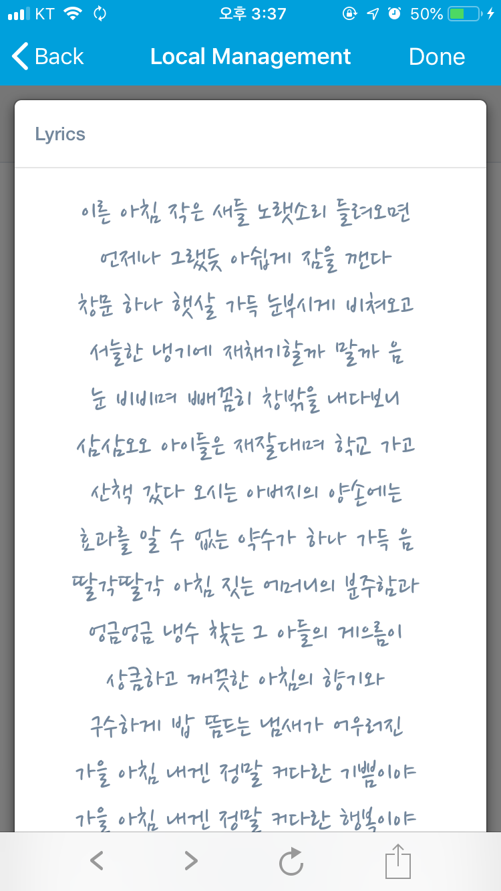
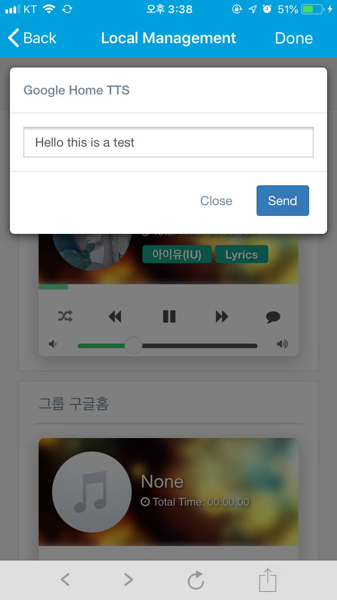
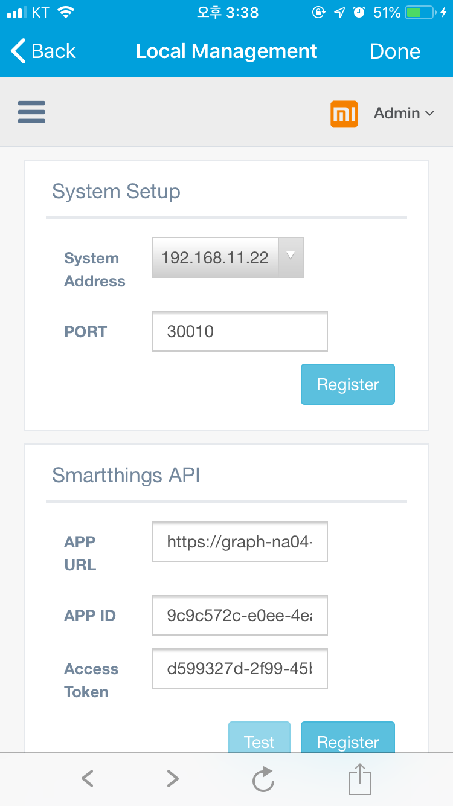
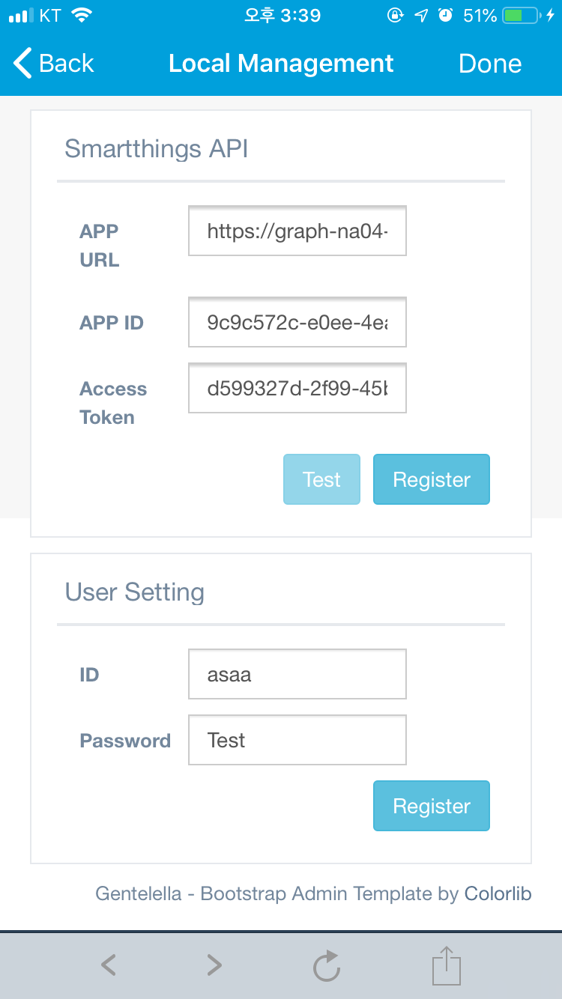


# Install
#### Preparing
```
You need a Raspbery pi or Synology Nas to install GH Connector API Server(Default port: 30010)
```
<br/><br/>

## Install API Server<br/>
#### Raspberry pi<br/>
> You must install docker first.
```
sudo mkdir /docker
sudo mkdir /docker/gh-connector
sudo chown -R pi:pi /docker
docker pull fison67/gh-connector:0.0.5
docker run -d --restart=always -v /docker/gh-connector:/config -v /yourMp3Folder:/music1 --name=gh-connector-rasp --net=host fison67/gh-connector:0.0.5
```

###### Synology nas<br/>
> You must install docker first.<br/>
```
make folder /docker/gh-connector
Run Docker
-> Registery 
-> Search fison67/gh-connector (0.0.5 version)
-> Advanced Settings
-> Volume tab -> folder -> Select gh-connector & Mount path '/config'
-> Volume tab -> folder -> Select MP3 Folder & Mount path '/music1'
-> Network tab -> Check 'use same network as Docker Host'
-> Complete
```


## Install DTH<br/>
<br/><br/>

## Install Smartapps<br/>
You must enable OAuth.
<br/><br/>


## API<br/>
```
TTS
address : /googleHome/api/:googleHomeID/tts (GET, POST)
param
A. type (oddcast, naver, kakao, googleTTS, google)
 a. oddcast (message, voice, volume)
 b. naver (message, voice, speed, volume)
 c. kakao (message, engine, voice, tone, volume)
 d. googleTTS (message, lang, voice, gender, volume)
 e. google (message, lang, speed, volume)
 
ex) docker address(192.168.0.100), googleHomeID(xxxxxxxxxxxxxxx)
http://192.168.0.100:30010/googleHome/api/xxxxxxxxxxxxxxx/tts?message=test&lang=ko&volume=20&type=google
```
```
Play MP3
address : /googleHome/api/:googleHomeID/play/:mp3Name (GET)
param
a. volume

ex) docker address(192.168.0.100), googleHomeID(xxxxxxxxxxxxxxx), mp3(test.mp3)
http://192.168.0.100:30010/googleHome/api/xxxxxxxxxxxxxxx/play/test&volume=20


```
